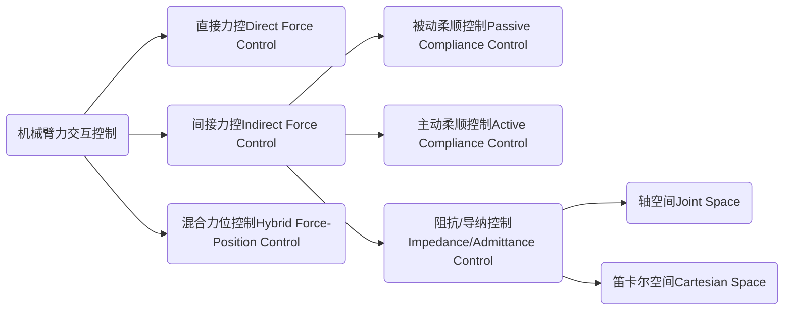

<!-- @import "[TOC]" {cmd="toc" depthFrom=1 depthTo=6 orderedList=false} -->

<!-- code_chunk_output -->

- [机器人学(Robotics)](#机器人学robotics)
  - [1. 数学理论(Mathmatics)](#1-数学理论mathmatics)
    - [1.1 姿态表述，偏差和插值](#11-姿态表述偏差和插值)
    - [1.2 最优化算法：梯度下降法，牛顿法，高斯-牛顿法，LM算法](#12-最优化算法梯度下降法牛顿法高斯-牛顿法lm算法123)
      - [1.2.1 梯度下降](#121-梯度下降)
      - [1.2.2 牛顿法](#122-牛顿法)
      - [1.2.3 高斯-牛顿法](#123-高斯-牛顿法)
      - [1.2.4 LM算法](#124-lm算法)
      - [1.2.5 总结](#125-总结)
    - [1.3 矩阵/向量基本运算规则](#13-矩阵向量基本运算规则)
      - [1.3.1 微分运算](#131-微分运算45)
      - [1.3.2 范数](#132-范数6)
      - [1.3.3 矩阵条件数](#133-矩阵条件数)
  - [2. 运动学(Kinematics)](#2-运动学kinematics)
    - [2.1 标准/改进DH法，正逆运动学：解析解/数值解](#21-标准改进dh法正逆运动学解析解数值解)
    - [2.2 雅可比矩阵：Jaco_rpy,Jaco_euler,Jaco之间的关系](#22-雅可比矩阵jaco_rpyjaco_eulerjaco之间的关系)
    - [2.3 误差模型，运动学标定：DH参数标定，绕针尖标定，手眼标定](#23-误差模型运动学标定dh参数标定绕针尖标定手眼标定)
  - [3. 动力学(Dynamics)](#3-动力学dynamics)
    - [3.1 牛顿-欧拉法建模，拉格朗日法建模，动力学方程](#31-牛顿-欧拉法建模拉格朗日法建模动力学方程)
    - [3.2 动力学方程线性化](#32-动力学方程线性化)
    - [3.3 动力学参数辨识，激励轨迹的求解](#33-动力学参数辨识激励轨迹的求解)
    - [3.4 柔顺控制：导纳/阻抗控制，力控制](#34-柔顺控制导纳阻抗控制力控制7)
  - [4. 运动规划(Motion Planning)](#4-运动规划motion-planning)
    - [4.1 路径规划：RRT及其变种，PRM及其变种](#41-路径规划rrt及其变种prm及其变种)
      - [4.1.1 RRT算法](#411-rrt算法8910)
    - [4.2 路径插补：贝塞尔曲线/样条曲线，多点连续位姿插补(squad算法)](#42-路径插补贝塞尔曲线样条曲线多点连续位姿插补squad算法)
    - [4.3 轨迹插补](#43-轨迹插补)
      - [4.3.1 梯形速度规划，多项式速度规划，DoubleS规划](#431-梯形速度规划多项式速度规划doubles规划)
      - [4.3.2 时间最优(路径-->轨迹)：IPTP，ISP，TOTP，Toppra等算法](#432-时间最优路径-轨迹iptpisptotptoppra等算法)
      - [4.3.3 ros_controllers中的轨迹插补](#433-ros_controllers中的轨迹插补)
  - [5. 遥操作(Teleoperation)](#5-遥操作teleoperation)
    - [5.1 遥操作的稳定性和透明性之间的关系](#51-遥操作的稳定性和透明性之间的关系)
    - [5.2 建立位姿映射关系：基于速度，以位置闭环](#52-建立位姿映射关系基于速度以位置闭环)
    - [5.3 增加从端虚拟位置约束，速度约束，增加主端力约束](#53-增加从端虚拟位置约束速度约束增加主端力约束)
  - [6. 机器人学习(Robot Learning)](#6-机器人学习robot-learning)
    - [6.1 轨迹泛化：DMP算法原理，KMP算法原理](#61-轨迹泛化dmp算法原理kmp算法原理)
    - [6.2 基于强化学习](#62-基于强化学习)
    - [6.3 基于模仿学习](#63-基于模仿学习)
  - [7. 机器人操作系统ROS](#7-机器人操作系统ros)
    - [7.1 ROS的架构与原理](#71-ros的架构与原理)
    - [7.2 MoveIt的架构与原理](#72-moveit的架构与原理)

<!-- /code_chunk_output -->

<!-- pagebreak -->

---
# 机器人学(Robotics)
---
<!-- pagebreak -->

## 1. 数学理论(Mathmatics)
### 1.1 姿态表述，偏差和插值
**轴角$\Rightarrow$旋转矩阵**
$$\mathbf{R} = \cos(\theta)\mathbf{I}+(1-\cos(\theta))\mathbf{u}\mathbf{u}^T+\sin(\theta)\mathbf{u}^{\wedge}
$$上式为罗德里格斯公式，其中$\mathbf{u}^{\wedge}$表示向量$\mathbf{u}$的斜对称矩阵

**旋转矩阵$\Rightarrow$轴角**
$$\theta = \arccos(\frac{tr(R)-1}{2}) \\
\mathbf{u} = \frac{1}{2\sin(\theta)}\begin{bmatrix}R(3,2)-R(2,3)\\R(1,3)-R(3,1)\\R(2,1)-R(1,2)\end{bmatrix} \\
\sin(\theta)\mathbf{u}^{\wedge} = \frac{(R-R^T)\theta}{2} \\
\sin(\theta)\mathbf{u} = \frac{(R-R^T)^\vee}{2}$$
上式中$^\vee$为斜对称矩阵的逆运算

**四元数与轴角**
$$\mathbf{q} = [\cos(\frac{\theta}{2}),\mathbf{u}\sin(\frac{\theta}{2})] \\
Exp(\mathbf{u}\theta) = e^{\frac{\theta}{2}\mathbf{u}} = \mathbf{q} \\
Log(\mathbf{q}) = 2log(\mathbf{q}) = 2\mathbf{u}\frac{\theta}{2} = \mathbf{u}\theta$$

**李群与李代数**
$$Lie group = e^{lie algebra} \\
SO(3) = e^{so(3)},SE(3) = e^{se(3)} \\
R = e^{\theta\mathbf{u}^{\wedge}}\in SO(3) = expm(\theta skew(\mathbf{u})) \\
\mathbf{u}\theta = vex(logm(R))$$

**四元数指数对数运算**
$$log(Matlab默认的对数运算):S^3\rightarrow H_p, \mathbf{q}\rightarrow log(\mathbf{q})=\mathbf{u}\theta(虚部) \\
Log(通常意义的四元数对数运算):S^3\rightarrow R^3,\mathbf{q}\rightarrow Log(\mathbf{q})=\mathbf{u}\phi(虚部) \\
Log(\mathbf{q}) = 2log(\mathbf{q}) \\
\phi = 2\arctan(\|\overrightarrow{q_v}\|,q_w) \\
\mathbf{u} = \overrightarrow{q_v}/\|\overrightarrow{q_v}\| \\
exp:R^3\rightarrow S^3,\mathbf{q}(0,\overrightarrow{u}\phi) \rightarrow exp(q)=[\cos(\phi),\overrightarrow{u}\sin(\phi)] \\
四元数求幂: \mathbf{q}^t = exp(tlog(\mathbf{q})),常用于插值$$

### 1.2 最优化算法：梯度下降法，牛顿法，高斯-牛顿法，LM算法[^1][^2][^3]
最优化问题的一般形式为：
> $min f(x)$
> $s.t.x \in X$
> 其中$x$为决策变量，$f(x)$为目标函数，$X$为约束集或可行域。特别地，如果$X=R^n$，则变成了无约束最优化问题

最优化方法通过采用迭代法求它的最优解，基本思路为$x_{k+1} = x_k+\alpha d_k$
上式中，$\alpha$为步长因子，$d_k$为搜索方向

#### 1.2.1 梯度下降
**介绍**：以所处的位置为基准，寻找这个位置最陡峭的地方，然后朝着下降方向走一步，然后又继续以当前位置为基准，再找最陡峭的地方，直到最后到达最低处。

**梯度**：在单变量函数中，梯度就是函数的微分，代表着函数在给定点的切线斜率，在多变量函数中，梯度是一个向量，其方向表示函数在给定点上升最快的方向。

**数学表示**：
$\mathbf{\Theta}_1 = \mathbf{\Theta}_0-\alpha\nabla J(\mathbf{\Theta})$

#### 1.2.2 牛顿法
**介绍**：牛顿法是求解无约束优化问题最早使用的经典方法之一：用迭代点$x_k$出的一阶导数(梯度)和二阶导数(海森矩阵)对目标函数进行二次函数近似，然后把二次模型的极小值点作为新的迭代点，并不断重复这个过程，直至得到满足精度要求得近似极小值点。

**数学推导**：
将函数$f(x)$在$x_k$处进行泰勒展开，那么前三项为
$$
q_k(x) = f(x_k)+\mathbf{g}_k^T(x-x_k)+\frac{1}{2}(x-x_k)^T\mathbf{H}_k(x-x_k)
$$
其中$\mathbf{g}_k=\nabla f(x_k)$，$\mathbf{H}_k=\nabla^2f(x_k)$
求二次函数$q_k(x)$得稳定点(求极值点，也就是令一阶导数为0)
$$
\nabla q_k(x) = \mathbf{g}_k+\mathbf{H}_k^{-1}(x-x_k) = 0
$$
若$\mathbf{H}_k$非奇异，那么上述方程的解(记其解为$x_{k+1}$)即为牛顿法的迭代公式
$$
x_{k+1} = x_k - \mathbf{H}_k^{-1}\mathbf{g}_k
$$
上述迭代公式中每步迭代都需要求解海森矩阵的逆$\mathbf{H}_k^{-1}$，在实际计算过程中，一般先通过解$\mathbf{H}_k^{-1}d=-\mathbf{g}_k$得到$d_k$，然后令$x_{k+1}=x_k+d_k$进行迭代来避免求逆。

#### 1.2.3 高斯-牛顿法
对于多变量单输出的函数，对变量求微分即得到梯度，对于多变量多输出的函数，对变量求微分即得到雅可比矩阵。
对于多变量多输出函数，其一阶泰勒展开表达式为
$$
\mathbf{f}(x) = \mathbf{f}(x_0)+\mathbf{J}(\mathbf{x}-\mathbf{x_0})+o(||\mathbf{x}-\mathbf{x_0}||)
$$
海森矩阵就是梯度的雅可比矩阵$\mathbf{H}(f_k(\mathbf{x})) = \mathbf{J}(\nabla f_k(x))$
设模型函数为$$f(x_1,x_2,...,x_p;\beta_1,\beta_2,...,\beta_n)$$，优化目标函数$$min S = \sum_{i=1}^m (f(\mathbf{x_i};\mathbf{\beta_i})-y_i)^2$$，那么第i次观测点的预测偏差为$$r_i = f(\mathbf{x_i};\mathbf{\beta_i})-y_i$$为标量，那么m次观测误差可以组成向量$\mathbf{r} = [r_1,r_2,...,r_m]^T$，那么目标函数便可以简化为$$S = \sum_{i=1}^m r_i^2 = \mathbf{r}^T\mathbf{r}$$

那么目标函数的梯度$$\nabla S(\mathbf{\beta}) = [\frac{\partial S}{\partial \beta_1},...,\frac{\partial S}{\beta_n}]^T$$
其中$$\frac{\partial S}{\beta_j} = 2\sum_{i=1}^m r_i\frac{\partial r_i}{\partial \beta_j}$$
最终梯度可以表示为$\nabla S = 2\mathbf{J}^T\mathbf{r}$，海森矩阵也可以近似表示为$\mathbf{H} = 2(\mathbf{J}^T\mathbf{J}+\mathbf{O})$

牛顿法可以进一步化简
$$\begin{aligned}
\mathbf{\beta_{k+1}} &= \mathbf{\beta_k} - \mathbf{H}^{-1}\mathbf{g}_k \\
&= \mathbf{\beta_k} - (2(\mathbf{J}^T\mathbf{J}+\mathbf{O}))^{-1}2\mathbf{J}^T\mathbf{r} \\
&= \mathbf{\beta_k} - (\mathbf{J}^T\mathbf{J})^{-1}\mathbf{J}^T\mathbf{r}
\end{aligned}$$

#### 1.2.4 LM算法
牛顿法虽然收敛速度快，但是需要计算海森矩阵，对于高维问题，计算二阶导数会很复杂，因此有了高斯-牛顿法。
高斯-牛顿法不直接计算海森矩阵，而是通过雅可比矩阵对海森矩阵进行近似：$\mathbf{H} \approx \mathbf{J}^T\mathbf{J}$

但是用雅可比矩阵近似海森矩阵，如果雅可比矩阵不正定，那么近似后的海森矩阵也不正定，此时牛顿法将不再收敛，所以要引入一个对角阵与之相加$\mathbf{H} \approx \mathbf{J}^T\mathbf{J}+\mu\mathbf{I}$。
这就得到了LM算法$$x_{k+1} = x_k - (\mathbf{J}^T\mathbf{J}+\mu\mathbf{I})^{-1}\mathbf{g}_k$$

当$\mu$接近0时，LM算法就近似于高斯-牛顿法，当$\mu$很大时，LM算法近似于梯度下降法，因此LM算法也称为高斯-牛顿法和梯度下降法的结合

#### 1.2.5 总结
|Algorithm      |Update Rules   |Convergence   |Computation Complexity   |
|---|---|---|---|
|EBP algorithm  |$\mathbf{w}_{k+1} = \mathbf{w}_k-\alpha \mathbf{g}_k$                  |Stable,slow|Gradient|
|Newton algorithm   |$\mathbf{w}_{k+1} = \mathbf{w}_k-\mathbf{H}_k^{-1}\mathbf{g}_k$    |Unstable,fast |Gradient,Hessian |
|Gauss-Newton algorithm |$\mathbf{w}_{k+1} = \mathbf{w}_k-(\mathbf{J}_k^T\mathbf{J}_k)^{-1}\mathbf{J}_k\mathbf{e}_k$ |Unstable,fast |Jacobian |
|Levenberg-Marquardt algorithm |$\mathbf{w}_{k+1} = \mathbf{w}_k-(\mathbf{J}_k^T\mathbf{J}_k+\mu\mathbf{I})^{-1}\mathbf{J}_k\mathbf{e}_k$ |Stable,fast |Jacobian |

[^1]: [最优化方法——梯度下降法、牛顿法、LM算法](https://blog.csdn.net/ha_lee/article/details/122363325)
[^2]: [最优化方法总结——梯度下降法、最速下降法、牛顿法、高斯牛顿法、LM法、拟牛顿法](https://blog.csdn.net/dongke1991/article/details/127981561)
[^3]: [Levenberg-Marquardt算法(LM)的前世今生](https://blog.csdn.net/qq_43349296/article/details/143635708)

### 1.3 矩阵/向量基本运算规则
#### 1.3.1 微分运算[^4][^5]
**梯度(Gradient)**：设$f(x)$是一个变量为x的标量函数，其中$\mathbf{x}=[x_1,x_2,...,x_n]^T$，那么定义$f(x)$对x的梯度为
$$\frac{\partial f}{\partial \mathbf{x}} = [\frac{\partial f}{\partial x_1},\frac{\partial f}{\partial x_2},...,\frac{\partial f}{\partial x_n}]^T$$

**雅可比矩阵(Jacobian matrix)**：设$\mathbf{f(\mathbf{x})}$是一个k×1的列向量函数$\mathbf{f(\mathbf{x})} = [f_1(\mathbf{x}),...,f_k(\mathbf{x})]^T$，那么定义$\mathbf{f(\mathbf{x})}$对x的雅可比矩阵为
$$\frac{\partial \mathbf{f}}{\partial \mathbf{x}^T} = \mathbf{J}(\mathbf{x}) = \begin{bmatrix}
\frac{\partial f_1}{\partial x_1} & \cdots & \frac{\partial f_1}{\partial x_n}\\
\vdots & \ddots & \vdots\\
\frac{\partial f_k}{\partial x_1} & \cdots & \frac{\partial f_k}{\partial x_n}\\
\end{bmatrix}$$

**Hessian矩阵(Hessian matrix)**：设$f(\mathbf{x})$是一个二阶可微的标量函数，那么定义$f(\mathbf{x})$对x的Hessian矩阵为
$$\frac{\partial^2f(x)}{\partial x\partial x^T} = \begin{bmatrix}
\frac{\partial^2 f(x)}{\partial x_1^2} & \cdots & \frac{\partial^2 f(x)}{\partial x_1\partial x_n}\\
\vdots & \ddots & \vdots\\
\frac{\partial^2 f(x)}{\partial x_n\partial x_1} & \cdots & \frac{\partial^2 f(x)}{\partial x_n^2}\\
\end{bmatrix}$$

**常用的矩阵求导公式**：
$$
\frac{\partial(\mathbf{x}^T\mathbf{a})}{\partial \mathbf{x}} = \frac{\partial(\mathbf{a}^T\mathbf{x})}{\partial \mathbf{x}} = \mathbf{a} \\
\frac{\partial(\mathbf{x}^T\mathbf{x})}{\partial \mathbf{x}} = 2\mathbf{x} \\ 
\frac{\partial(\mathbf{x}^T\mathbf{A}\mathbf{x})}{\partial \mathbf{x}} = \mathbf{A}\mathbf{x}+\mathbf{A}^T\mathbf{x} \\
\frac{\partial(\mathbf{a}^T\mathbf{x}\mathbf{x}^T\mathbf{b})}{\partial \mathbf{x}} = \mathbf{a}\mathbf{b}^T\mathbf{x}+\mathbf{b}\mathbf{a}^T\mathbf{x}
$$
上式中，$\mathbf{a},\mathbf{b}$为常数列向量，$\mathbf{x}$为列向量变量
$$
\frac{\partial x^T}{\partial x} = I, \frac{\partial x}{\partial x^T} = I, \frac{\partial(x^TA)}{\partial x} = A \\
\frac{\partial(Ax)}{\partial x^T} = A, \frac{\partial(Ax)}{\partial x} = A^T, \frac{\partial(x^TA)}{\partial x^T} = A^T
$$
上式中，A为m×n矩阵，x为n×1的列向量

#### 1.3.2 范数[^6]
**向量范数**：对向量大小的度量方式，最典型也是应用最广泛的L2范数
1. $L_0$范数：$\|\mathbf{x}\|_0 = $非零元素的个数
2. $L_1$范数：$\|\mathbf{x}\|_1 = \sum_{i=1}^m |x_i|$，各个元素的绝对值之和
3. $L_2$范数：$\|\mathbf{x}\|_2 = \sqrt{\sum_{i=1}^m x_i^2}$，各个元素的平方和的平方根
4. $L_p$范数：$\|\mathbf{x}\|_p = (\sum_{i=1}^m |x_i|^p)^{1/p}$，各个元素的绝对值p次方之和的p次方根
5. $L_{\infty}$范数：$\|\mathbf{x}\|_{\infty} = \max(|x_i|)$

**矩阵范数**：对向量范数进行推广，就获得了矩阵范数，因此矩阵范数也是对矩阵的一种度量方式，矩阵范数主要有三种类型：诱导范数，元素范数和Schatten范数
诱导范数：m×n矩阵空间上的算子范数，常用的诱导范数为p-范数
$$|\mathbf{A}||_p = \max\frac{\|Ax\|_p}{\|x\|_p},x \neq 0$$
特别地，当$p=1,2,\infty$时，对应的诱导范数分别为
$$\|A\|_1 = \max\sum_{i=1}^m|a_{ij}|,1\leq j\leq n \\
\|A\|_2 = \sigma_{max}(A),A的最大奇异值 \\
\|A\|_{\infty} = \max\sum_{j=1}^n|a_{ij}|,1\leq i\leq m$$

元素范数：将m×n矩阵排列成mn×1向量，然后采用向量的范数定义，矩阵F-范数可以表示为$\|A\|_F = \sqrt{tr(AA^T)}$
Schatten范数：略

#### 1.3.3 矩阵条件数
**定义**：$cond(A) = \|A\|\|A\|^{-1}$，其中$\|\bullet\|$表示矩阵的范数
几种常用的条件数：
$cond_1(A) = \|A\|_1\|A\|_1^{-1}$(1-条件数)
$cond_2(A) = \|A\|_2\|A\|_2^{-1}$(2-条件数)
$cond_{\infty}(A) = \|A\|_{\infty}\|A\|_{\infty}^{-1}$($\infty$-条件数)
$cond_F(A) = \|A\|_F\|A\|_F^{-1}$(Frobenius范数的条件数)
最常见的2-条件数有如下公式：$cond_2(A) = \frac{\sigma_{max}}{\sigma_{min}}$，$\sigma_{max}$是最大奇异值，$\sigma_{min}$是最小奇异值

[^4]: [矩阵求导——基础篇](https://zhuanlan.zhihu.com/p/273729929)
[^5]: [矩阵求导相关公式汇总](https://blog.csdn.net/qq_39463175/article/details/121695202)
[^6]: [矩阵基础 | 向量范数与矩阵范数](https://zhuanlan.zhihu.com/p/265713608)

---
<!-- pagebreak -->

## 2. 运动学(Kinematics)
### 2.1 标准/改进DH法，正逆运动学：解析解/数值解
### 2.2 雅可比矩阵：Jaco_rpy,Jaco_euler,Jaco之间的关系

### 2.3 误差模型，运动学标定：DH参数标定，绕针尖标定，手眼标定

---
<!-- pagebreak -->

## 3. 动力学(Dynamics)
### 3.1 牛顿-欧拉法建模，拉格朗日法建模，动力学方程
### 3.2 动力学方程线性化
### 3.3 动力学参数辨识，激励轨迹的求解
### 3.4 柔顺控制：导纳/阻抗控制，力控制[^7]

**直接力控**：对外力直接进行力控制，核心是通过操作期望力与测量力之间差值的方式实现相应力控
**间接力控-被动柔顺控制**：在机械臂末端加装相应的柔性装置
**间接力控-主动柔顺控制**：人为将机械臂末端的目标位置设计在相应目标物之后，机械臂为了到达不可达的目标位置而不可避免与目标物发生力交互
实际应用中，广泛采用的是混合力位控制，笛卡尔空间的阻抗/导纳控制，重点介绍这三种控制方法

查看笔记本上的控制框架图

[^7]: [彻底搞懂阻抗控制、导纳控制、力位混合控制](https://blog.csdn.net/a735148617/article/details/108564836)

---
<!-- pagebreak -->

## 4. 运动规划(Motion Planning)
### 4.1 路径规划：RRT及其变种，PRM及其变种
#### 4.1.1 RRT算法[^8][^9][^10]
快速搜索随机树算法（Rapidly-exploring Random Tree，RRT）由Lavalle提出，是一种采用增量方式增长的随机采样算法，用于解决有代数约束（障碍带来的）和微分约束（非完整性和动态环境带来的）的高维空间问题。RRT算法的优势在于无需对系统进行建模，无需对搜索区域进行几何划分，在搜索空间的覆盖率高，搜索的范围广，可以尽可能的探索未知区域。但同时也存在算法计算代价过大的问题。研究者们提出RRT的多种改进形式来解决这类问题。比如Goal-bias RRT算法，Bi-RRT算法，RRT-Connect算法，Extend RRT算法，Local-tree-RRT算法，Dynamic-RRT算法等。其中Goal-Bias算法将目标节点作为采样点出现，并且算法中还可以控制目标点出现的概率。Extend RRT算法，引入路径点集合，加快了收敛速度，提高了路径的稳定性。Bi-RRT算法和RRT-Connect算法从初始点和目标点生成两棵树，直到两棵树连在一起算法收敛，这种改进型提高了算法的效率。Local-tree-RRT算法针对随机采样算法狭窄通道难以迅速通过的问题，提出局部树方法加以解决。Dynamic RRT算法提出了修剪和合并操作，去除掉无效的节点后再继续进行搜索。
**RRT算法基本原理**
$$\begin{align*}
& GENERATE\_ RRT(x_{init},K,\Delta t) \\
& 1.\space T.init(x_{init}) \\
& 2.\space for \space k=1 \space to \space K do \\
& 3.\space if(\|x_{new} - x_{gaol}\| < d) \\
& 4.\space break \\
& 5.\space x_{rand} \leftarrow RANDOM\_ STATE() \\
& 6.\space x_{near} \leftarrow NEARST\_ NEIGHBOR(x_{rand},T) \\
& 7.\space u \leftarrow SELECT\_ INPUT(x_{rand},x_{near}) \\
& 8.\space x_{new} \leftarrow NEW\_ STATE(x_{near},u,\Delta t) \\
& 9.\space judge(x_{new}) \\
& 10.\space if(judge(x_{new})==false\space and\space colisionfree()==false) \\
& 11.\space continue \\
& 12.\space T.add\_ vertex(x_{new}) \\
& 13.\space T.add\_ edge(x_{near},x_{new},u) \\
& 14.\space return \space T
\end{align*}$$
- RANDOM_STATE()函数在设定环境内部产生随机点
- NEARST_NEIGHBOR()函数遍历随机数，找出距离随机点最近的节点
- SELECT_INPUT()函数按照已设定好的值扩展随机树
- NEW_STATE()函数生成$x_{new}$
- judge()函数判断新生成的节点是否满足非完整约束
- $T.add\_ vertex(x_{new})$插入$x_{new}$
- $T.add\_ edge(x_{near},x_{new},u)$增加一条边

具体过程为：
- 首先产生第一个节点$x_{init} \in X_{free}$，在每一次循环中，产生一个随机点$x_{rand}$，随机点的生成时任意的，可以在整个状态空间内
- 在产生随机点后，遍历随机树中的每一个节点，计算每一个节点与该循环生成的随机点之间的距离，找出距离此随机点最近的节点，记为$x_{near}$
- 定义一个步进变量EPS，当找到$x_{near}$时，$x_{near}$向$x_{near}$与$x_{rand}$连线方向扩展EPS步长，因此这里的EPS也就是状态方程的输入u，扩展后产生新的节点$x_{new}$
- 判断$x_{new}$是否满足非完整微分约束，如果不满足，舍弃$x_{new}$，重新产生新的随机点。如果满足非完整微分约束，则加入$x_{new}$，并在$x_{near}$到$x_{new}$之间加上一条边
- 相应的，再插入新节点$x_{new}$的过程中，如果$x_{near}$、$x_{new}$和$x_{near}$到$x_{new}$之间的边任意一个位于$X_{obs}$中或者与$X_{obs}$相交，则此次循环不添加任何节点，在下一次循环中重新生成新的随机点$x_{new}$，然后再进行判断，如果属于$X_{free}$，则保留新节点
- 总之，在加入新节点时需要两次判断，分别为障碍物检测和非完整约束检测，当且仅当两者都满足要求时，才加入新节点

**基于目标的快速RRT算法**
$x_{rand}$在随机树扩展中相当于给定一个扩展的方向，以一定的概率将目标点作为$x_{rand}$，就等价于驱使随机树向着目标方向扩展
但为了保持随机树对未知空间的扩展能力，概率通常不宜选择的过大(通常0.05-0.1)。这种目标偏好的随机树扩展一个显著的缺点是，容易陷入局部搜索无法跳出，尤其是障碍物遮挡目标时。随着目标偏好的程度加大，跳出局部搜索困难越大。因此目标偏好概率的选取要折衷算法效率和RRT扩展能力。

**RRT-Connect算法**
RRT Connect算法从初始状态点和目标状态点同时扩展随机树从而实现对状态空间的快速搜索

**RRT*算法**
RRT*算法的目标在于解决RRT算法难以求解最优的可行路径的问题，它在路径查找的过程中持续的优化路径，随着迭代次数和采样点的增加，得到的路径越来越优化。迭代的时间越久，就越可以得到相对满意的规划路径。
RRT*算法与RRT算法的区别主要在于两点：
1. 重新为$x_{new}$选择父节点的过程
RRT*在找到距离$x_{rand}$最近的节点$x_{near}$并通过CollisionFree检测之后，并不立即将Edge(x_{near},x_{rand})加入扩展树中，而是以$x_{rand}$为半径，r为半径，找到所有潜在的父节点集合，并与$x_{near}$父节点的Cost对比，看是否存在更优Cost的父节点

另一种表述方式：
遍历整个树，
获得到新节点$x_{new}$的距离小于一定阈值(比如1.5倍步长)的所有节点，
将这些节点加入到一个名为candidate_parent_of_newpoint的列表中，
为了方便，这些节点的distance不再用来存储到出发点的距离，而是用来存储如果把该节点设置为$x_{new}$的父节点的话，$x_{new}$到出发点的距离，
找到candidate_parent_of_newpoint列表中具有最小distance的节点，返回它的索引，将新节点$x_{new}$的父节点设置为index

2. 随机树重布线的过程
遍历整个列表，对每一个节点执行如下动作{
  if(该节点到xnew的距离小于一定的阈值，比如1.6倍步长){
    if(该节点现在的distance大于把该节点的父节点设置为xnew之后的distance){
      把该节点的父节点设置为xnew，并更新该节点的distance值，
      更新以该节点为根节点的子树的所有distance值
    }
  }
}

RRT*算法的核心在于上述的两个过程：重新选择父节点和重布线。这两个过程相辅相成，重新选择父节点使新生成的节点路径代价尽可能小，重布线使得生成新节点后的随机树减少冗余通路，减小路径代价。

[^8]: [路径规划——改进RRT算法](https://zhuanlan.zhihu.com/p/51087819)
[^9]: [基于采样的运动规划算法-RRT(Rapidly-exploring Random Trees)](https://zhuanlan.zhihu.com/p/133224593)
[^10]: [改进RRT算法路径规划详解：原理分析、Python仿真与对比分析](https://www.iotword.com/28288.html)

### 4.2 路径插补：贝塞尔曲线/样条曲线，多点连续位姿插补(squad算法)
### 4.3 轨迹插补
#### 4.3.1 梯形速度规划，多项式速度规划，DoubleS规划
#### 4.3.2 时间最优(路径-->轨迹)：IPTP，ISP，TOTP，Toppra等算法
#### 4.3.3 ros_controllers中的轨迹插补
---
## 5. 遥操作(Teleoperation)
### 5.1 遥操作的稳定性和透明性之间的关系
### 5.2 建立位姿映射关系：基于速度，以位置闭环
### 5.3 增加从端虚拟位置约束，速度约束，增加主端力约束
---
## 6. 机器人学习(Robot Learning)
### 6.1 轨迹泛化：DMP算法原理，KMP算法原理
### 6.2 基于强化学习
### 6.3 基于模仿学习
---
## 7. 机器人操作系统ROS
### 7.1 ROS的架构与原理
### 7.2 MoveIt的架构与原理

